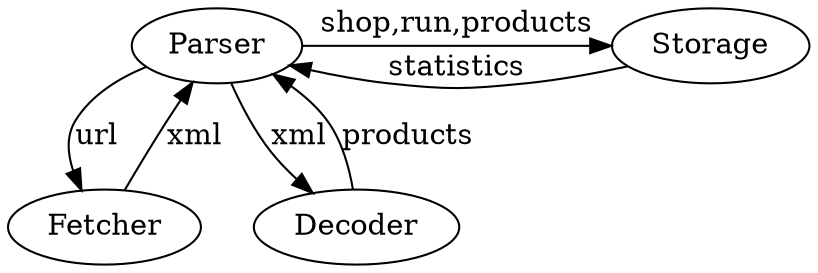
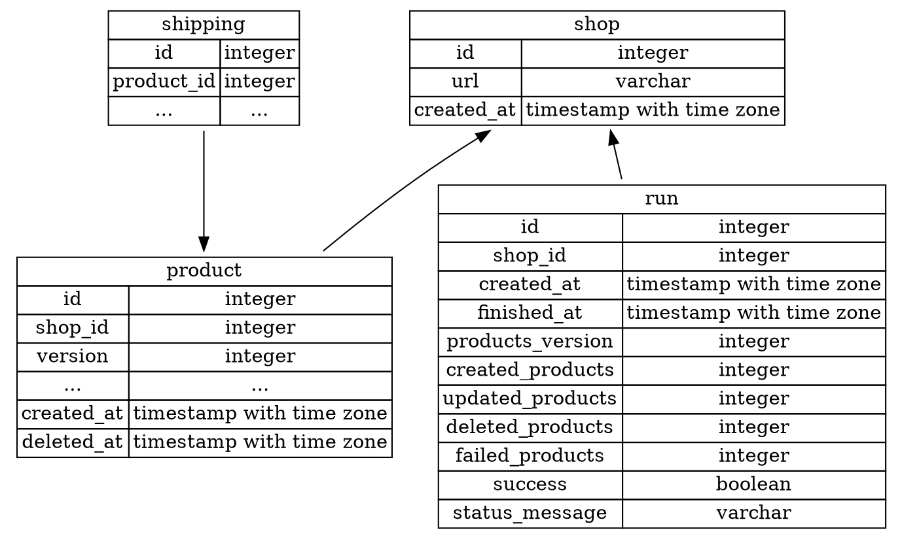

# Google Feed Parser
Small service for fetching and parsing [Google xml product feeds](https://support.google.com/merchants/answer/7052112?hl=en#basic_product_data) written for demonstration purposes.

Google xml feeds can be used to import products list to Google Merchant Center, so they can be shown in search results.

The goal of the service is to fetch, parse and store feed products in Postgres database.
Parsing is triggered by sending RabbitMQ message with shop URL, then the service saves shop into database and starts parsing only if there is no other parsing performed for this shop at the same time (it is done by saving parsing "runs" for each shop with its status and statistics).
After it, the service downloads feed file (and optionally decompresses it), decodes it as xml and updates products in database with assigning version (timestamp) to each product.
If the same shop is parsed second time, its products are updated - products from freshly downloaded feed are upserted with new higher version and outdated products from database which are not present in new feed are marked as deleted.

## Run

Requirements:
- Makefile
- Docker + docker-compose
- go (preferably 1.22.2, required to install goose)
- [goose](https://github.com/pressly/goose) (can be installed with `make install-goose`)

To run the service, clone the repository and run:
```sh
make run
```

To run only infrastructure (rabbitmq, postgres):
```sh
make infra
```

Stop running containers:
```sh
make stop
```

Show all makefile commands:
```sh
make help
```

## Tools

There are several tools used inside this project:
- [golangci](https://golangci-lint.run) - runs linters
- [goose](https://github.com/pressly/goose) - runs database migrations
- [mockery](https://github.com/vektra/mockery) - generates mocks used in tests
- [jet](https://github.com/go-jet/jet) - generates database models

## Linters

For linters enabled in golangci please check `.golangci.yaml` file.
To lint the code in cloned repository run:
```sh
make golangci
```

## Tests

### run all tests
```sh
make test
```

### unit tests
```sh
make unit
```

### integration tests
```sh
make integration
```

### e2e tests
```sh
make e2e
```

As this project was created for demonstration purposes and its scope is pretty big, not all its parts are 100% polished.
Known packages which should be refactored and have tests implemented or improved are:
- `/internal/platform/rabbitmq` - very basic rabbitmq consuming stuff
- `/internal/platform/handler` - small and not critical logic, TODO: add tests
- `/internal/platfrom/storage` - TODO: some refactor needed
- `/e2e` - add more tests scenarios

## Components

Basic components of the service are:
- Fetcher - fetches xml files and optionally decompresses them
- Decoder - decodes xml files into products
- Storage - handles storing data (Postgres in this case)
- Parser - uses Fetcher, Decoder and Storage to parse feed file into products in database



## Database

To run local database:
```sh
make infra
```
This should start local postgres at `localhost:15432`

Local database creds:

```
username: local
password: local
```

Database schema:


## Deployment

There is no deployment configuration as I had no plans or reason to deploy the service, but current implementation is designed as long-running solution, so it can be easily deployed as k8s Deployment with some hpa dependent on input queue size.

However, it can be easily modified to be deployed as GCP Cloud Function or AWS Lambda, only required modification is to prepare separate main.go file, which wouldn't use RabbitMQ, but get input from Cloud Function/Lambda. After it, it can be triggered by GCP Cloud Scheduler or other events.
It could also take input from env variable and be deployed as k8s job/cronjob.
